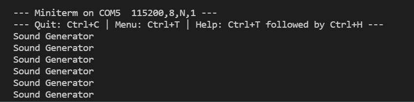

# Práctica 7.1 Buses de comunicación III (I2S)
###### Andrea Muñiz
<p></p>

## Programa + explicación

> Declaramos las librerias necesarias

```
#include <Arduino.h>
#include <FS.h>
#include <SPIFFS.h>
#include <HTTPClient.h>
#include <SD.h>
#include <AudioGeneratorAAC.h>
#include <AudioOutputI2S.h>
#include <AudioFileSourcePROGMEM.h>
#include <sampleaac.h>
```

> Creamos punteros de los tipos:
- _AudioFileSourcePROGMEM_
- _AudioGeneratorAAC_
- _AudioOutputI2S_

```
AudioFileSourcePROGMEM *in;
AudioGeneratorAAC *aac;
AudioOutputI2S *out;
```

> Función setup()

En esta función inicializamos el Serial a una velocidad de 115200. A continuación programamos los distintos punteros. En el caso de _in_ será de tipo _AudioFileSourcePROGMEM_, _aac_ será de tipo _AudioGeneratorAAC_ y _out_ de tipo _AudioOutputI2S_.
Por último se pasan los datos necesarios a estas variables. para _out_ se le pasa el valor de ganancia y los pines utilizados en la placa correspondientes a _LRC_, _BCLK_ y _DIN_ del componente MAX98357A y _aac_ se inicializa pasándole las variables de entrada y salida _in_ y _out_.

```
void setup(){
  Serial.begin(115200);

  in = new AudioFileSourcePROGMEM(sampleaac, sizeof(sampleaac));
  aac = new AudioGeneratorAAC();
  out = new AudioOutputI2S();
  out -> SetGain(0.125);
  out -> SetPinout(26, 25, 22);
  aac -> begin(in, out);
}
```

> Función bucle

Dentro de esta función generamos un bucle _if_ en el cual si el puntero aac está funcionando entonces se entra en la función _loop()_ en caso contrario deja de funcionar _aac_ y se escribe por el monitor "Sound Generator".

```
void loop(){
  if(aac -> isRunning()){
    aac -> loop();
  }
  else{
    aac -> stop();
    Serial.printf("Sound Generator\n");
    delay(1000);
  }
}
```

***

## Salidas de la impresión serie

Una vez cargado el programa en el microcontrolador, por el altavoz se puede escuchar una persona hablando y una vez acabado el audio, se escribe por pantalla "Sound Generator" como se puede observar en la imagen.

